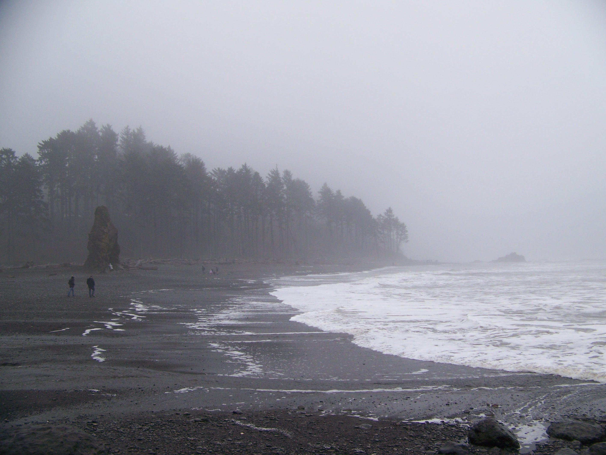

I am a biostatistician and graduate student at the University of Washington, Seattle, with a background in software engineering and a deep passion for public health. Although my expertise is leveraging clever methods to investigate data and uncover its underlying story, I'm really driven by the people behind the numbers. **I believe good analysis is honest, clear, and rooted in real-world impact.** I look forward to entering the industry---applied statistics is fabulous work! I love to encounter new problems and learn new science, and I love to help people.

*Special interests*: Longitudinal and survival analysis, spatial disease mapping, causal inference in observational studies

*Software*: Statistics {R, SAS, Python}, Version control {git}, Database management {SQL}, Data Visualization {Tableau, PowerBI}

*Snag Flat, a stand of old-growth trees on Mount Si, in January*

# I come from the Computer Science field

Pursuing an undergraduate degree in Computer Science with a minor in Statistics provided the perfect foundation for a Master’s in Biostatistics. The rigorous programming and algorithmic problem-solving skills I developed in one program allowed me to approach data analysis with efficiency and precision, while coursework in the other built my understanding of probability, inference, and modeling. The combination of computational and analytical expertise made the transition into Biostatistics seamless, equipping me with the tools to tackle complex healthcare data and contribute meaningfully to medical research.

# Graduate school has revealed the world of Public Health to me

Graduate school has not just been an opportunity to gain technical skill, but to deepen my understanding of myself and my place in the world. Focusing on public health throughout graduate school has my eyes to the power of real-world data analysis in addressing pressing health challenges. Working with large, messy datasets from hospitals and observational studies, I learned how to extract meaningful insights that could drive policy decisions and improve patient outcomes and organizational success. My experiences reinforced a passion for using data to make a tangible impact, bridging the gap between statistical theory and real-world applications in healthcare.

# My next steps into Applied Statistics

My future plans are to work! Throughout my journey, I have gained a deep understanding of my strengths and passions. I am excited to apply my skills in public health, using data to drive evidence-based decisions and improve healthcare outcomes. Entering the industry, I look forward to tackling new challenges, learning from diverse scientific fields, and contributing to meaningful research. Applied statistics is incredibly rewarding---I love solving problems, uncovering insights, and ultimately helping people. Thoughtful, honest science has always been my goal, and each experience has been a crucial step toward that mission.

## Check out my other pages! Have questions? Want to reach out and connect with me? Please do not hesitate!

*Katsuō-ji, north of Osaka, in September*

*Ruby Beach, on the Washington coast, in November*

*Tahoma (Mount Rainier) from the University of Washington, in February*

*Pike's Place Market on Elliott Bay, in January*
